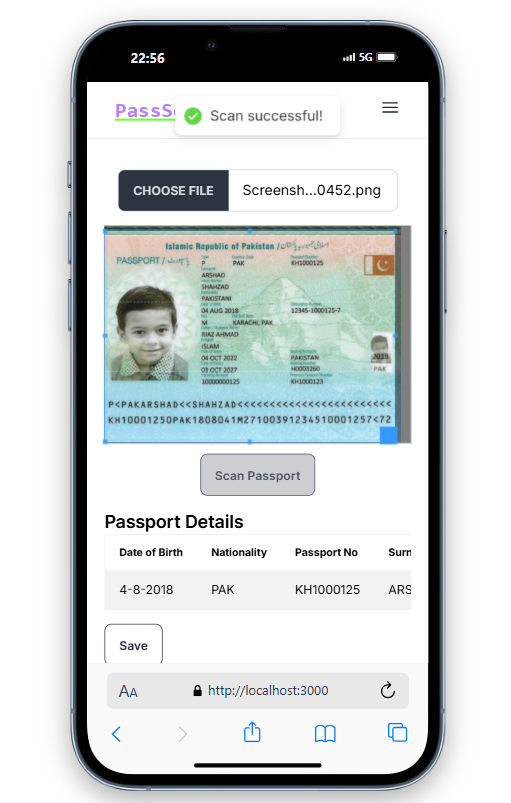
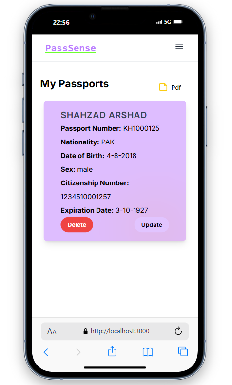
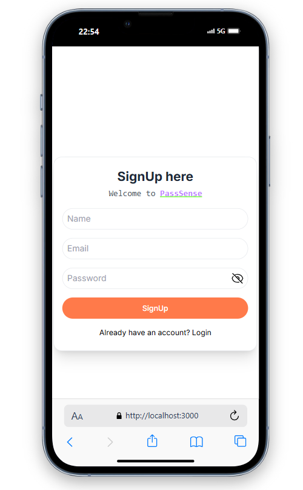
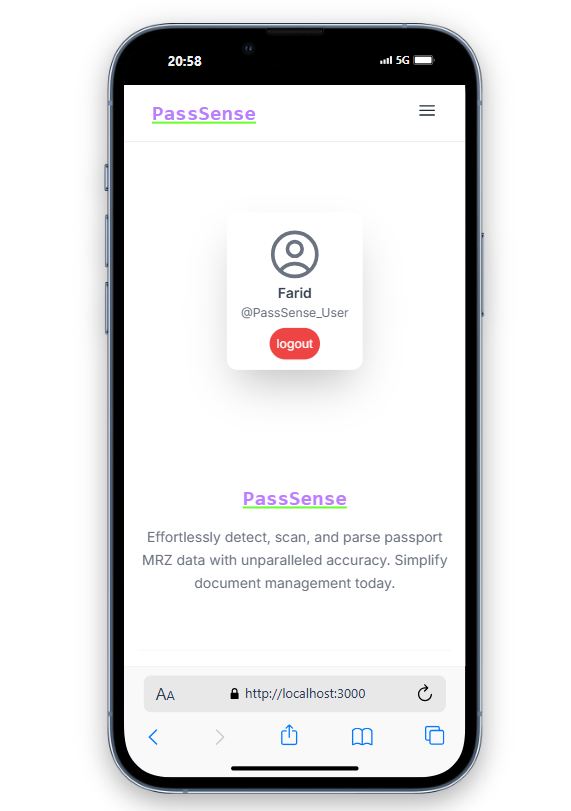
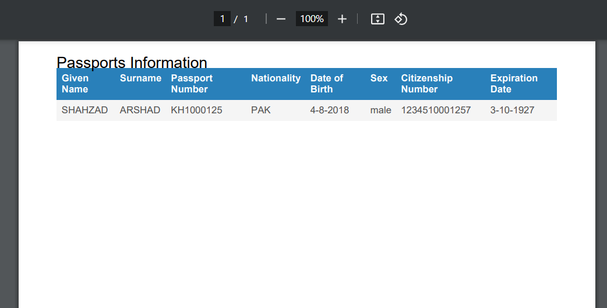

# [PassSense](https://pass-sense.vercel.app)

PassSense is an advanced web application designed to simplify and streamline passport management. With state-of-the-art technology, it detects, scans, and parses the Machine Readable Zone (MRZ) of passports, providing accurate and efficient data extraction for various use cases such as identity verification, travel documentation, and record management.


- **Live Demo**: Check out the live demo of PassSense [here](https://pass-sense.vercel.app).

## Features

- **User Management**: Users can sign up, log in, and log out of the application. They can also update their profile information and reset their password.
- **Email Verification**: SMTP is used to send email verification to users. After verification by OTP on email, users can access the scanner.
- **Passport Management**: Save scanned passports, delete them, edit them, and generate PDFs.


## Contributing

This project is open for contributions! If you have any good ideas or enhancements, feel free to contribute. Please check the issues section for any ongoing discussions or to report any problems. I welcome all contributions to make PassSense even better.


## Screenshots

### Home


### Guide


### Scan


### User Scans


### Login


### Profile


### PDF Screen



## Getting Started

To get started with PassSense, follow the guide provided in the application to set up your account and begin scanning passports.


## Environment Variables

To run this application, you need to set up the following environment variables inside backend/config/.env:

```
PORT=5000
MONGO_URL=
JWT_SECRET=
JWT_EXPIRES_IN=7d
NODE_ENV=DEVELOPMENT
SMTP_HOST=smtp.gmail.com
SMTP_PORT=465
SMTP_EMAIL=
SMTP_PASSWORD=
FROM_NAME=PassSense
FROM_EMAIL=
Client_URL=http://localhost:3000
```

## Running the Application

The application consists of two directories: `backend` and `frontend`. Follow the steps below to run the application:

### Backend

1. Navigate to the `backend` directory:
    ```sh
    cd backend
    ```

2. Install the dependencies:
    ```sh
    npm install
    ```

3. Start the backend server:
    ```sh
    npm run dev
    ```

### Frontend

1. Navigate to the `frontend` directory:
    ```sh
    cd frontend
    ```

2. Install the dependencies:
    ```sh
    npm install
    ```

3. Start the frontend server:
    ```sh
    npm start
    ```

The application should now be running, and you can access it at `http://localhost:3000`.

## License

This project is licensed under the MIT License.

## Contact

For more information, please contact me at hammad.node@gmail.com.
